# Whisper-Diarization-PST — Codebase Workflow

> **Branch baseline.** The original upstream code is anchored at commit
> `8d87f2e` ("Implement new diarization model: Sortformer"). Everything in
> **Part II** and **Part III** was added by commits newer than `8d87f2e`. Each
> section tags whether it describes `[ORIGINAL]` or `[BRANCH]` code.

---

## Table of Contents

1. [Tech Stack](#1-tech-stack)
2. [Repository Structure](#2-repository-structure)
3. [Part I — Original Pipeline (`diarize.py`)](#3-part-i--original-pipeline-diarizepy)
4. [Part II — Speaker Persistence Pipeline (branch)](#4-part-ii--speaker-persistence-pipeline-branch)
5. [Part III — FastAPI Server (branch)](#5-part-iii--fastapi-server-branch)
6. [Known Issues & Caveats](#6-known-issues--caveats)
7. [Quick Reference](#7-quick-reference)

---

## 1. Tech Stack

| Layer | Library / Tool | Role in the pipeline | Used by |
|---|---|---|---|
| **ASR (transcription)** | `faster-whisper` ≥1.1.0 (CTranslate2 backend) | Whisper speech-to-text with batched long-form inference | `diarize.py`, `diarize_parallel.py`, `server.py` |
| **Source separation** | `demucs` (MahmoudAshraf97 fork), `htdemucs` model | Isolates vocals from music/noise (`--two-stems=vocals`) | `diarize.py:148` (subprocess) |
| **Forced alignment** | `ctc-forced-aligner` (MahmoudAshraf97 fork) | wav2vec2 CTC aligner — turns Whisper's coarse segments into precise per-word timestamps | `diarize.py:202-231`, `server.py` |
| **Diarization** | `nemo_toolkit[asr]` ≥2.5.0 | `NeuralDiarizer` (MSDD: MarbleNet VAD → TitaNet embeddings → MSDD decoder) **or** `SortformerEncLabelModel` (end-to-end, ≤4 speakers) | `diarization/msdd/msdd.py`, `diarization/sortformer/sortformer.py` |
| **Speaker embeddings** `[BRANCH]` | NeMo `EncDecSpeakerLabelModel` (`titanet_large`) | Produces 192-dim speaker embeddings from audio segments | `speaker_embedder.py` |
| **Punctuation** | `deepmultilingualpunctuation` (`kredor/punctuate-all`) | Restores `.?!` to the raw transcript | `diarize.py:282`, `server.py` |
| **Sentence tokenization** | `nltk` (`PunktSentenceTokenizer`) | Detects sentence breaks for sentence↔speaker mapping | `helpers.py:378` |
| **Persistence** `[BRANCH]` | `sqlite3` (stdlib) | Stores speaker profiles (name + 192-dim embedding BLOB) | `speaker_store.py` |
| **Web server** `[BRANCH]` | `fastapi` + `uvicorn` | Long-running HTTP service with preloaded models | `server.py` |
| **Validation/schemas** `[BRANCH]` | `pydantic` | Request/response models for the API | `server.py:47-74` |
| **Tensors** | `torch`, `numpy` (<2) | Audio waveforms, embeddings, GPU memory mgmt | everywhere |
| **Config** | `omegaconf` | Loads NeMo YAML configs | `diarization/msdd/msdd.py:13` |
| **Audio I/O** | `ffmpeg` (external binary) | Decodes/compresses audio; server-side conversion to 16 kHz mono WAV | `diarize.py` (via demucs/whisper), `server.py:419` |

**Python:** ≥3.10 (uses PEP 604 `X | None` unions). The workspace `whisper` conda env uses 3.11. **External runtime deps:** FFmpeg on `PATH`, a CUDA GPU is recommended (CPU works but is slow).

---

## 2. Repository Structure

```
whisper-diarization-pst/
├── diarize.py                 # [ORIG] Sequential pipeline entry point (CLI)
├── diarize_parallel.py        # [ORIG] Parallel variant: Whisper ∥ NeMo in a child process
├── helpers.py                 # [ORIG] Word/sentence mapping, SRT/TXT writers, lang tables
├── diarization/               # [ORIG] Diarizer backends package
│   ├── __init__.py            #        Exports DiarizationResult [BRANCH], MSDDDiarizer, SortformerDiarizer
│   ├── msdd/
│   │   ├── msdd.py            #        MSDDDiarizer (NeMo) + DiarizationResult dataclass [BRANCH]
│   │   └── diar_infer_telephonic.yaml  # NeMo MSDD config template
│   └── sortformer/
│       └── sortformer.py      #        SortformerDiarizer (NeMo Sortformer, ≤4 spk)
├── server.py                  # [BRANCH] FastAPI service with preloaded models + 3 API modes
├── speaker_store.py           # [BRANCH] SpeakerEmbeddingStore — SQLite-backed speaker profiles
├── speaker_embedder.py        # [BRANCH] SpeakerEmbedder — wraps titanet_large, 192-dim embeddings
├── speaker_matcher.py         # [BRANCH] match_speakers() — vectorized cosine similarity
├── persistent_diarizer.py     # [BRANCH] PersistentSpeakerDiarizer orchestrator + apply_persistent_labels
├── speakerctl.py              # [BRANCH] CLI tool: list / rename / delete / show / deleteall
├── helpers.py                 # [ORIG+BRANCH] get_sentences_speaker_mapping patched for string labels
├── tests/                     # [BRANCH] 71 tests + conftest.py (mocks NeMo/torch/etc.)
│   ├── conftest.py
│   ├── test_speaker_store.py
│   ├── test_speaker_matcher.py
│   ├── test_persistent_diarizer.py
│   ├── test_speaker_embedder.py
│   ├── test_server.py
│   └── test_helpers.py
├── requirements.txt           # [ORIG] ML deps
├── constraints.txt            # [ORIG] numpy<2, indic-numtowords pin
├── pyproject.toml             # [ORIG] ruff config
├── BRANCH_CONTEXT.md          # [BRANCH] Changelog for this branch
├── docs/superpowers/          # [BRANCH] Design spec + implementation plan
└── _myco_/                    # [BRANCH] Project memory artifacts
```

**Original files at `8d87f2e` had NO Python tests** — `tests/` contained only
`assets/test.opus`. The entire test suite (71 tests + `conftest.py`) is a branch
addition. `conftest.py` mocks NeMo/torch/omegaconf/faster-whisper/
ctc_forced_aligner/deepmultilingualpunctuation so tests run without a GPU.

---

## 3. Part I — Original Pipeline (`diarize.py`)

### 3.1 Big Picture

The original repo is a **linear, stateless, single-shot script**. There is no
`main()` function and no `if __name__ == "__main__"` guard in `diarize.py` — it
executes top-to-bottom on import. Every run reloads every model (Demucs via
subprocess, Whisper, alignment model, NeMo diarizer), costing ~20 s of startup.
The entire branch's `server.py` exists to eliminate that per-run reload.

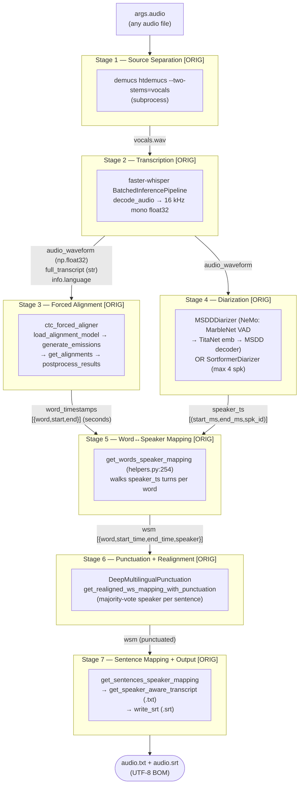

### 3.2 Sequence Diagram — Original End-to-End Run

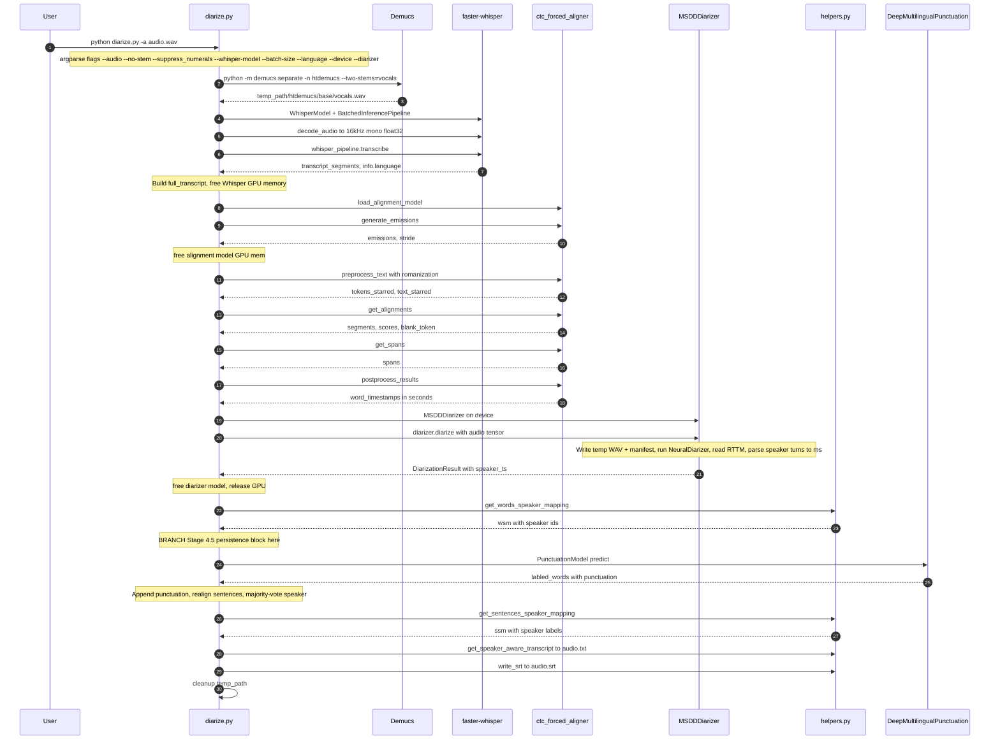

### 3.3 The Eight Stages in Detail

| Stage | File:line | Model / Library | Input → Output |
|---|---|---|---|
| **1. Source separation** | `diarize.py:145-167` | Demucs `htdemucs` (`--two-stems=vocals`, subprocess) | `args.audio` → `temp_path/htdemucs/<base>/vocals.wav` (44.1 kHz stereo; resampled to 16 kHz mono by faster-whisper's `decode_audio`) |
| **2. Transcription** | `diarize.py:170-200` | faster-whisper `BatchedInferencePipeline` (CTranslate2 Whisper) | vocals.wav → `audio_waveform` (np.float32, 16 kHz mono) + `full_transcript` + `info.language` |
| **3. Forced alignment** | `diarize.py:202-231` | ctc-forced-aligner (wav2vec2 CTC) | `audio_waveform` + `full_transcript` → `word_timestamps` `[{word,start_sec,end_sec}]` |
| **4. Diarization** | `diarize.py:239-259` | NeMo MSDD (MarbleNet VAD → TitaNet emb → MSDD) or Sortformer | `audio_waveform` tensor → `speaker_ts` `[(start_ms,end_ms,spk_id:int)]` |
| **5. Word↔speaker mapping** | `helpers.py:254` | pure Python | `word_timestamps` + `speaker_ts` → `wsm` `[{word,start_time,end_time,speaker}]` |
| **6. Punctuation + realignment** | `diarize.py:282-312`, `helpers.py:305` | DeepMultilingualPunctuation (`kredor/punctuate-all`) | `wsm` words → `wsm` with `.?!` appended; then re-segmented into sentences with majority-voted speaker labels |
| **7. Sentence mapping** | `helpers.py:377` | nltk PunktSentenceTokenizer | `wsm` + `speaker_ts` → `ssm` `[{speaker:"Speaker N",start_time,end_time,text}]` |
| **8. Output** | `diarize.py:317-321`, `helpers.py:405,440` | pure Python | `ssm` → `<audio>.txt` (UTF-8-BOM, speaker paragraphs) + `<audio>.srt` (standard SRT) |

### 3.4 Key Data Shapes Flowing Through the Pipeline

| Variable | Type | Shape / Example |
|---|---|---|
| `audio_waveform` | `numpy.ndarray` float32 | 1-D, 16 kHz mono, e.g. `shape=(16000*duration,)` |
| `full_transcript` | `str` | concatenated Whisper segment text |
| `info.language` | `str` | Whisper language code, e.g. `"en"`, `"zh"` |
| `word_timestamps` | `list[dict]` | `[{"word":"hello","start":0.0,"end":0.42}, ...]` (seconds, floats) |
| `speaker_ts` | `list[tuple[int,int,int]]` | `[(0, 2400, 0), (2400, 5100, 1), ...]` (ms, ints) |
| `wsm` (word-speaker mapping) | `list[dict]` | `[{"word":"hello","start_time":0,"end_time":420,"speaker":0}, ...]` (ms, ints) |
| `ssm` (sentence-speaker mapping) | `list[dict]` | `[{"speaker":"Speaker 0","start_time":0,"end_time":2400,"text":"hello world"}, ...]` |

### 3.5 The `diarization/` Package — Backend Diarizers

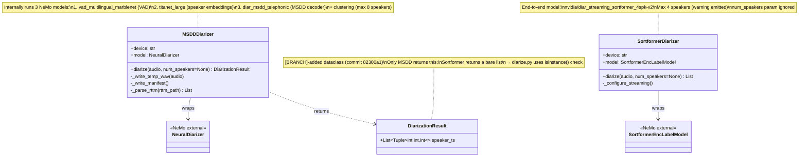

**MSDD internal flow** (`diarization/msdd/msdd.py`):
1. `MSDDDiarizer.__init__(device)` — `NeuralDiarizer(cfg=create_config()).to(device)`.
2. `diarize(audio, num_speakers=None)`:
   - Writes `audio` (float tensor) to a temp 16 kHz mono int16 WAV.
   - Writes a NeMo manifest JSON (`audio_filepath`, `offset:0`, `label:"infer"`, `text:"-"`).
   - `_initialize_configs(manifest, max_speakers=8, num_speakers=num_speakers, batch_size=24)`.
   - `self.model.diarize()` → writes `pred_rttms/mono_file.rttm`.
   - Parses each RTTM line `"start end speaker_N"` → `(int(start*1000), int(end*1000), N)`.
   - Returns `DiarizationResult(speaker_ts=labels)`.

**`create_config()`** loads `diar_infer_telephonic.yaml` and overrides:
- `speaker_embeddings.model_path = "titanet_large"`
- `vad.model_path = "vad_multilingual_marblenet"`
- `msdd_model.model_path = "diar_msdd_telephonic"`
- `oracle_vad = False`, `oracle_num_speakers = False`
- VAD thresholds: `[BRANCH]` changed to `onset=0.1, offset=0.1, min_duration_off=0.1` (originally `onset=0.8, offset=0.6, pad_offset=-0.05`).

### 3.6 `diarize_parallel.py` — Parallel Variant

Same pipeline, but launches NeMo diarization in a **child process** concurrent
with Whisper transcription. MSDD-only (Sortformer not wired in).

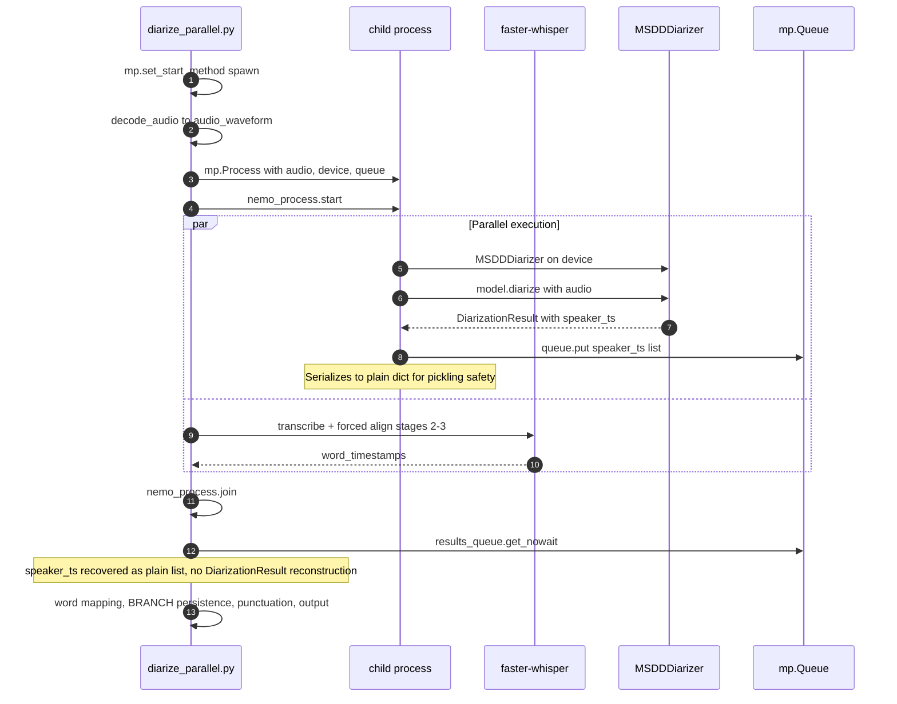

**Key differences from `diarize.py`:**
- `mp.set_start_method("spawn", force=True)` — required for CUDA (fork breaks CUDA contexts).
- Guarded by `if __name__ == "__main__":` (unlike `diarize.py`).
- Default `--whisper-model` is `large-v2` (vs `medium.en`), `--batch-size` is 4 (vs 8).
- `--diarizer` choices is `[msdd]` only.
- The worker serializes `DiarizationResult` to `{"speaker_ts": [...]}` before putting it on `mp.Queue`; the main side recovers a plain list (no `DiarizationResult` reconstruction).

### 3.7 CLI Arguments of `diarize.py`

**Original (at `8d87f2e`):**

| Flag | Default | Purpose |
|---|---|---|
| `-a` / `--audio` | (required) | Target audio file path |
| `--no-stem` | `True` (store_false) | Disable Demucs source separation |
| `--suppress_numerals` | `False` | Suppress digit/$/£ tokens (improves diarization) |
| `--whisper-model` | `medium.en` | Whisper model name |
| `--batch-size` | `8` (`0` = original long-form) | Batched inference size |
| `--language` | `None` (auto-detect) | Language code/name; `choices=whisper_langs` |
| `--device` | `cuda` if available else `cpu` | Compute device |
| `--diarizer` | `msdd` (`choices=[msdd, sortformer]`) | Diarization backend |

**Branch-added (after `8d87f2e`):**

| Flag | Default | Purpose |
|---|---|---|
| `--speaker-db` | `~/.whisper-diarization/speakers.db` | SQLite speaker profile DB path |
| `--match-threshold` | `0.75` (float) | Min cosine similarity to match a known speaker |
| `--interactive` | `False` | Prompt for new speaker names instead of auto-labeling |
| `--no-persist` | `False` | Disable persistent matching (restore original behavior) |
| `--skip-diarization` | `False` | Skip NeMo entirely; fabricate a single dummy `speaker_ts` |
| `--num-speakers` | `None` (int) | Oracle speaker count passed to MSDD |

---

## 4. Part II — Speaker Persistence Pipeline `[BRANCH]`

### 4.1 Goal

Instead of discarding speaker embeddings after each run, store them in SQLite
and cross-reference in all subsequent diarizations. When a speaker's embedding
matches a stored profile (cosine similarity above threshold), the persistent
label is used instead of an arbitrary integer like "Speaker 0". Users can label
new speakers interactively (CLI) or via a management tool (`speakerctl.py` /
HTTP API).

### 4.2 Architecture — Post-Processing Layer

The diarization pipeline itself is **untouched**. Persistence is a pure
post-processing layer inserted as **Stage 4.5** between diarization and word
mapping:

```
Stage 1-4: Unchanged (Source Sep → Transcription → Forced Alignment → Diarization)
Stage 4.5 (NEW): Per-Segment Speaker Embedding Verification
  ├── Extract per-segment embeddings via SpeakerEmbedder (titanet_large) from audio
  ├── Compare each segment embedding against stored profiles in SQLite
  ├── Match speakers above minimum cosine similarity threshold (0.75)
  ├── For unmatched speakers: auto-assign "Speaker N" or prompt interactively
  └── Update stored profiles with matched/new embeddings (running average)
Stage 5-7: Unchanged (Word mapping, punctuation, output)
```

### 4.3 Class Diagram — Persistence Components

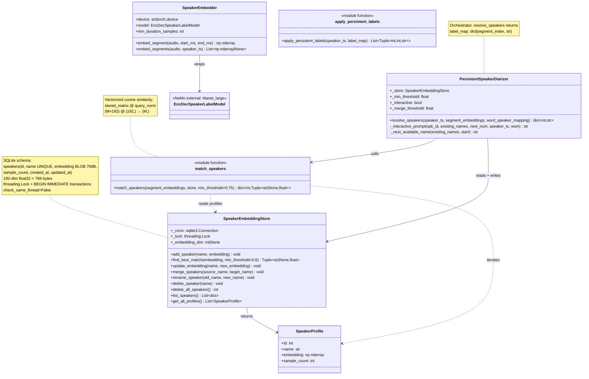

### 4.4 Component Deep-Dive

#### 4.4.1 `speaker_store.py` — `SpeakerEmbeddingStore`

SQLite-backed storage. **Schema** (`speaker_store.py:40-53`):
```sql
CREATE TABLE IF NOT EXISTS speakers (
    id INTEGER PRIMARY KEY AUTOINCREMENT,
    name TEXT UNIQUE NOT NULL,
    embedding BLOB NOT NULL,           -- 192-dim float32 → 768 bytes
    sample_count INTEGER DEFAULT 1,
    created_at TIMESTAMP DEFAULT CURRENT_TIMESTAMP,
    updated_at TIMESTAMP DEFAULT CURRENT_TIMESTAMP
)
```

**Embedding serialization** (`speaker_store.py:68-72`):
- `_serialize_embedding(emb)` → `emb.astype(np.float32).tobytes()` (768-byte BLOB).
- `_deserialize_embedding(blob)` → `np.frombuffer(blob, dtype=np.float32).copy()` (the `.copy()` is essential — `frombuffer` returns a read-only view).

**Cosine similarity** in `find_best_match` (`speaker_store.py:122-139`):
```
query_norm  = embedding   / (||embedding||   + 1e-8)
stored_norm = profile.emb / (||profile.emb|| + 1e-8)
score = float(np.dot(query_norm, stored_norm))
```
Returns `(name, score)` if `score >= min_threshold` (default **0.6** here), else `(None, score)`.

> Note: `find_best_match` is the **scalar** variant and is **not on the main
> batch path**. The pipeline uses `match_speakers` (default threshold **0.75**)
> which is vectorized.

**Running average** in `update_embedding` (`speaker_store.py:141-166`):
```python
updated = (old_embedding * old_count + new_embedding) / (old_count + 1)
```
Then writes `updated` and `sample_count = old_count + 1`. This is an incremental
weighted mean. `find_best_match` re-normalizes before comparison, so matching
stays correct even as stored vectors drift from unit norm.

**Concurrency safety** (`speaker_store.py:27,29`):
- `sqlite3.connect(resolved, check_same_thread=False)` — allows cross-thread sharing.
- `self._lock = threading.Lock()` — serializes all write methods.
- Every write method (`add_speaker`, `update_embedding`, `merge_speakers`,
  `rename_speaker`, `delete_speaker`) wraps its body in `BEGIN IMMEDIATE` →
  checks → `INSERT`/`UPDATE`/`DELETE` → `COMMIT`, with `ROLLBACK` on exception.
  `BEGIN IMMEDIATE` acquires a RESERVED lock immediately, avoiding the
  upgrade-deadlock that plain deferred transactions can hit.

**Dimension validation**: the first speaker sets `_embedding_dim`; subsequent
must match (raises `ValueError` otherwise).

**Default DB path**: `~/.whisper-diarization/speakers.db`.

#### 4.4.2 `speaker_embedder.py` — `SpeakerEmbedder`

Wraps NeMo `EncDecSpeakerLabelModel.from_pretrained("titanet_large")` → 192-dim
embeddings (`speaker_embedder.py:12-16`).

- `__init__(device)` — loads model, `.to(device).eval()`, sets `min_duration_samples = int(0.5 * 16000) = 8000` (0.5 s at 16 kHz).
- `embed_segment(audio, start_ms, end_ms)` (`speaker_embedder.py:18-34`):
  - `audio` is a torch.Tensor; squeezes channel dim if present.
  - Sample rate is implicitly **16 kHz**: `start_sample = start_ms * 16`, `end_sample = end_ms * 16`.
  - Slices `segment = audio[start_sample:end_sample]`.
  - **Short-segment padding**: if `segment.shape[0] < 8000` (< 0.5 s), right-pads with zeros to 8000 via `torch.nn.functional.pad`.
  - Forward: `self.model.forward(segment.unsqueeze(0).to(device), torch.tensor([segment.shape[0]], device=device))` under `torch.no_grad()`.
  - Returns `emb.squeeze(0).cpu().numpy()` → `np.float32` shape `(192,)`.
- `embed_segments(audio, speaker_ts)` (`speaker_embedder.py:36-51`): iterates `for start, end, _ in speaker_ts`, calls `embed_segment` per segment; on any exception appends `None` and logs. Output is a list positionally aligned with `speaker_ts`, with `None` for failures.

#### 4.4.3 `speaker_matcher.py` — `match_speakers()`

**Pure function** (`speaker_matcher.py:8-12`). Signature:
```python
def match_speakers(
    segment_embeddings: List[Optional[np.ndarray]],
    store: SpeakerEmbeddingStore,
    min_threshold: float = 0.75,
) -> dict[int, tuple[str | None, float]]:
```

> **Important:** This is the **per-segment** matcher (refactored by commit
> `360ed24`). The input is a **list of per-segment embeddings** indexed by
> segment position, and the output is keyed by **segment index** — not by
> `speaker_id` as an earlier design did.

**Vectorized cosine similarity** (`speaker_matcher.py:17-37`):
- Builds a stacked matrix of L2-normalized stored vectors: `stored_matrix` shape `(M, 192)`.
- Per segment: skips `None`; otherwise `query_norm = emb / (||emb|| + 1e-8)`, then `scores = stored_matrix @ query_norm` shape `(M,)` — cosine similarity to every stored profile in one matrix-vector multiply.
- `best_idx = argmax(scores)`; if `best_score >= min_threshold` → `(stored_names[best_idx], best_score)`, else `(None, best_score)`.

**No "collision resolution" here** — multiple segments may legitimately map to
the same stored name. Collision-like behavior is handled downstream in
`PersistentSpeakerDiarizer` via cluster-label voting and new-speaker merging.

#### 4.4.4 `persistent_diarizer.py` — `PersistentSpeakerDiarizer`

**Orchestrator** that ties `match_speakers` and `SpeakerEmbeddingStore`
together (`persistent_diarizer.py:66-76`).

`resolve_speakers(speaker_ts, segment_embeddings, word_speaker_mapping=None) -> dict[int, str]`
(`persistent_diarizer.py:78-173`) — returns a `label_map` keyed by **segment
index** (not speaker id). Steps:

```mermaid
flowchart TD
    Start([resolve_speakers called]) --> M["1. match_speakers(segment_embeddings, store, 0.75)<br/>→ matches: dict[seg_idx, (name|None, score)]"]
    M --> Split{"2. Split matched vs unmatched"}
    Split -->|"name is not None"| Matched["label_map[seg_idx] = name"]
    Split -->|"name is None"| Unmatched["unmatched_indices"]
    Matched --> Cluster
    Unmatched --> Cluster{"3. Cluster-label propagation<br/>(same spk_id peer already matched?)"}
    Cluster -->|"yes — vote majority label"| Propagate["assign majority label<br/>from cluster peers"]
    Cluster -->|"no — truly unmatched"| StillUnmatched["still_unmatched"]
    Propagate --> Group
    StillUnmatched --> Group["4. Group still-unmatched by spk_id<br/>→ new_groups: dict[spk_id, list[seg_idx]]"]
    Group --> Mean["5. Compute mean embedding per new group<br/>np.mean(embs, axis=0) (fallback zeros(192))"]
    Mean --> Merge["6. merge_new_speakers(new_speaker_embeddings, 0.85)<br/>pairwise cosine >= 0.85 → merge into canonical id"]
    Merge --> Name["7. Name each new speaker<br/>interactive? _interactive_prompt<br/>else _next_available_name → 'Speaker N'"]
    Name --> Persist["8. Persist: if name in store → update_embedding (running avg)<br/>else add_speaker(name, mean_emb)<br/>Also update merged peers"]
    Persist --> Update["9. Update matched speakers' embeddings<br/>mean_emb = np.mean(matched seg embeddings)<br/>store.update_embedding(name, mean_emb)"]
    Update --> Return([return label_map: dict[seg_idx, str]])
```

**Interactive prompt** (`persistent_diarizer.py:175-220`) — shown only when
`--interactive` is set:
```
New speaker detected (0:07.50 - 0:12.30):
  "hello world this is my first sentence"
Enter name [default: Speaker 0]:
```
- Builds `sample` via `_get_sample_sentence(wsm, spk_id)` — the first sentence
  spoken by that speaker (stops at first `.?!`).
- Builds `timestamp` from the speaker's first segment.
- Non-TTY fallback (`persistent_diarizer.py:205-206`): if `not sys.stdin.isatty()`, returns `default_name` immediately (no hang on piped/automated runs).
- **Merge check**: if the chosen name already exists, prompts `'{chosen}' already exists. Merge with existing speaker? [y/n]: `; on `y`, returns `chosen` (caller will `update_embedding` the existing profile).

**Auto-label** (`_next_available_name`, `persistent_diarizer.py:222-226`):
returns the smallest `n ≥ start` such that `"Speaker {n}"` is **not** already a
stored name.

**`apply_persistent_labels(speaker_ts, label_map)`** (`persistent_diarizer.py:11-18`):
```python
return [(start, end, label_map.get(i, str(spk_id)))
        for i, (start, end, spk_id) in enumerate(speaker_ts)]
```
Converts each segment's integer `spk_id` into its persistent string label by
looking up the segment **index** `i` in `label_map`. Output third element is
now a **string**.

#### 4.4.5 `speakerctl.py` — CLI Management Tool

Standalone CLI (`speakerctl.py:69-106`) with subcommands:

| Subcommand | Args | Behavior |
|---|---|---|
| `list` | — | Prints `name (samples: N, created: ..., updated: ...)` per speaker |
| `rename` | `<old_name> <new_name> [--force]` | `--force` triggers a **merge** (`store.merge_speakers`) instead of an error when `new_name` exists |
| `delete` | `<name>` | `store.delete_speaker(name)` |
| `show` | `<name>` | Linear scan of `list_speakers()`; prints Name/Samples/Created/Updated |
| `deleteall` | — | `store.delete_all_speakers()`, prints count |

Each command opens its own `SpeakerEmbeddingStore(args.db)` (global `--db`
flag, default `~/.whisper-diarization/speakers.db`) and closes it when done.

### 4.5 Stage 4.5 — Sequence Diagram (CLI, persistence on, MSDD)

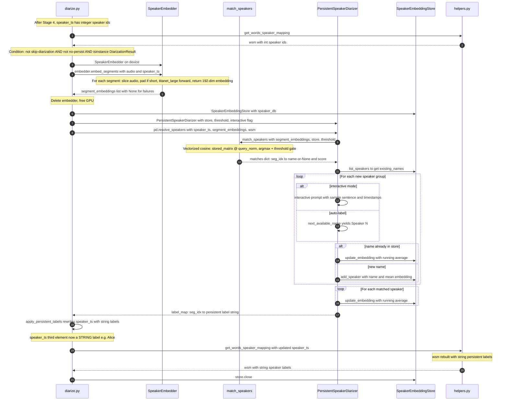

### 4.6 Integration Points

**`diarize.py` Stage 4.5 block** (`diarize.py:263-280`):
```python
if not args.skip_diarization and not args.no_persist and isinstance(diarization_result, DiarizationResult):
    embedder = SpeakerEmbedder(device=args.device)
    segment_embeddings = embedder.embed_segments(torch.from_numpy(audio_waveform), speaker_ts)
    del embedder; torch.cuda.empty_cache()
    store = SpeakerEmbeddingStore(args.speaker_db)
    pd = PersistentSpeakerDiarizer(store=store, min_threshold=args.match_threshold, interactive=args.interactive)
    label_map = pd.resolve_speakers(speaker_ts, segment_embeddings, word_speaker_mapping=wsm)
    speaker_ts = apply_persistent_labels(speaker_ts, label_map)
    wsm = get_words_speaker_mapping(word_timestamps, speaker_ts, "start")
    store.close()
```

The `isinstance(diarization_result, DiarizationResult)` gate means **persistence
only runs under MSDD** — `SortformerDiarizer.diarize()` returns a plain list, so
the gate silently disables persistence for sortformer.

**`--skip-diarization` path** (`diarize.py:233-237`): fabricates a single dummy
`speaker_ts = [[first_word_start, last_word_end, 0]]` spanning the full audio
and sets `diarization_result = None`, which disables persistence (the gate
above requires a `DiarizationResult`).

**`helpers.py` modification** (`helpers.py:383,391`):
```python
"speaker": spk if isinstance(spk, str) else f"Speaker {spk}",
```
When `spk` is a string (persistent label like `"Alice"`), uses it directly;
when it's an int (persistence off), formats as `"Speaker {spk}"`.

### 4.7 `DiarizationResult` Dataclass `[BRANCH]`

Added by commit `82300a1` (`diarization/msdd/msdd.py:16-18`):
```python
@dataclass
class DiarizationResult:
    speaker_ts: List[Tuple[int, int, int]]
```
- Only `MSDDDiarizer.diarize()` returns this; `SortformerDiarizer.diarize()` returns a bare list.
- `diarize.py:253-256` uses `isinstance(diarization_result, DiarizationResult)` for backward compat.
- `diarize_parallel.py` does **not** reconstruct `DiarizationResult` on the main side — the worker unpacks to `{"speaker_ts": [...]}` before crossing `mp.Queue`.

---

## 5. Part III — FastAPI Server `[BRANCH]`

### 5.1 Why a Server?

The CLI scripts reload every model on each invocation (~20 s overhead). The
server **preloads all models once at startup** and serves requests from memory.
It also adds concurrency infrastructure (semaphores, locks, background tasks)
and three API modes optimized for different use cases.

### 5.2 Architecture Overview

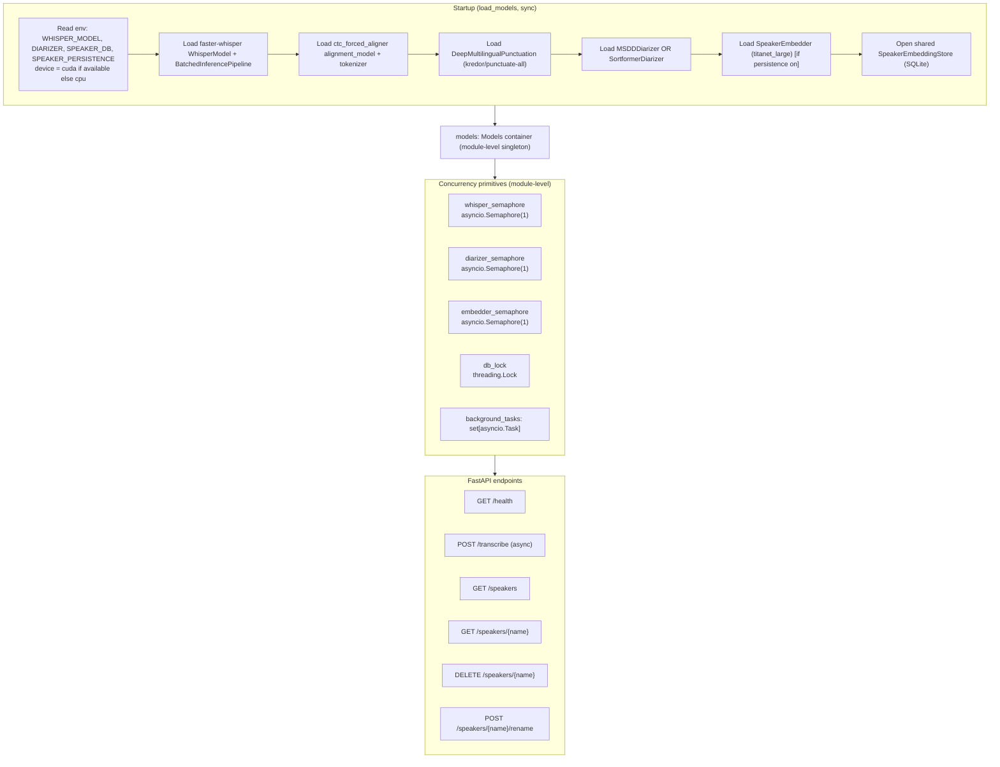

### 5.3 Environment Variables

| Env var | Default | Purpose |
|---|---|---|
| `WHISPER_MODEL` | `medium.en` | Whisper model name |
| `DIARIZER` | `msdd` | `msdd` or `sortformer` |
| `SPEAKER_DB` | `~/.whisper-diarization/speakers.db` | SQLite path for speaker profiles |
| `SPEAKER_PERSISTENCE` | `1` (truthy) | `0`/`false`/`no` disables persistence + embedder + store |
| (device) | auto | `"cuda" if torch.cuda.is_available() else "cpu"` |

**Startup command:** `python server.py` (binds `0.0.0.0:8000`, single uvicorn worker).

### 5.4 Endpoints

| Method | Path | Body | Response | 503 when? |
|---|---|---|---|---|
| GET | `/health` | — | dict: `status, device, whisper_loaded, alignment_loaded, punct_loaded, diarizer_loaded, embedder_loaded, speaker_persistence, speaker_db, pending_db_updates` | never |
| POST | `/transcribe` | multipart form | `TranscriptionResult` | never (degrades silently) |
| GET | `/speakers` | — | `SpeakerList` | persistence disabled |
| GET | `/speakers/{name}` | — | `SpeakerInfo` or 404 | persistence disabled |
| DELETE | `/speakers/{name}` | — | `{"detail": ...}` or 404 | persistence disabled |
| POST | `/speakers/{name}/rename` | JSON `RenameRequest` | `{"detail": ...}` or 409/404 | persistence disabled |

### 5.5 `POST /transcribe` — Form Parameters

> **Important correction to BRANCH_CONTEXT.md:** there is **no `speaker_db`
> form parameter**. `speaker_db` is only an **environment variable** (`SPEAKER_DB`)
> read once at startup. The actual form parameters are:

| Param | Type | Default | Purpose |
|---|---|---|---|
| `audio` | `UploadFile` | required (`File(...)`) | The audio file (WAV/FLAC passed through; everything else ffmpeg-converted to 16 kHz mono WAV) |
| `language` | `str \| None` | `None` | Whisper language hint; `None` → auto-detect |
| `batch_size` | `int` | `8` | Batched-inference batch size; `0` → original longform with `vad_filter=True` |
| `suppress_numerals` | `bool` | `False` | Suppress numeral/symbol tokens for diarization accuracy |
| `skip_diarization` | `bool` | `False` | **Mode 1 switch**: skip NeMo diarizer entirely |
| `include_srt` | `bool` | `True` | Include SRT string in response |
| `no_persist` | `bool` | `False` | Skip persistent speaker matching (Mode 2 only) |
| `match_threshold` | `float` | `0.75` | Min cosine similarity to match a known speaker (Mode 2 only) |
| `speaker_name` | `str \| None` | `None` | **Mode 3 switch**: known-speaker name |
| `num_speakers` | `int \| None` | `None` | Oracle speaker count passed to diarizer (Mode 2 only) |

**Validation** (`server.py:395-402`): `speaker_name is not None and skip_diarization` → HTTP 400.

### 5.6 Pydantic Models

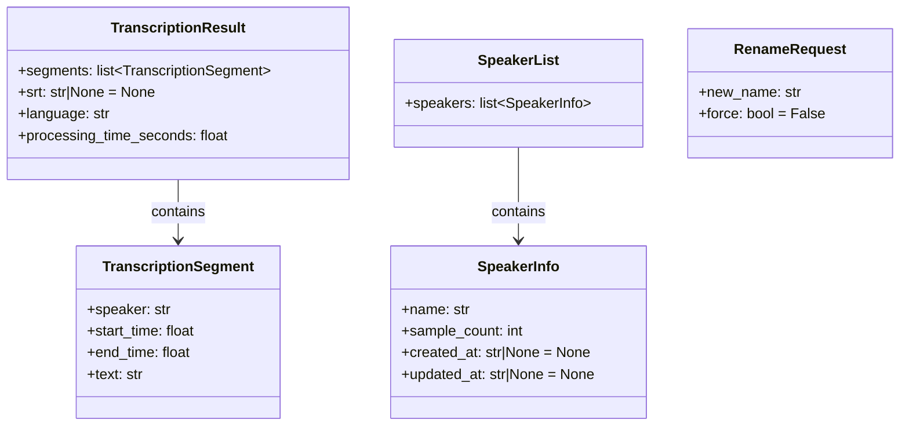

### 5.7 The Three API Modes

Mode selection is driven by `skip_diarization` and `speaker_name`:

| Mode | `skip_diarization` | `speaker_name` | Use case | Response latency |
|---|---|---|---|---|
| **1. Transcribe only** | `true` | — | Service testing, misc | Whisper + alignment only |
| **2. Meeting diarization** | `false` | — | Meeting transcript, who said what | Whisper + alignment + diarization + embedding + DB match |
| **3. Known speaker** | `false` | `"Alice"` | STT button press, update user embedding | Whisper + alignment only (embedding + DB update run in background) |

All three modes share a **preamble** (`server.py:395-464`): validation → save
upload to temp file → ffmpeg convert if needed → `decode_audio` → run
Whisper+alignment under `whisper_semaphore`. They diverge after `word_timestamps`
are obtained.

#### 5.7.1 Mode 1 — Transcribe Only

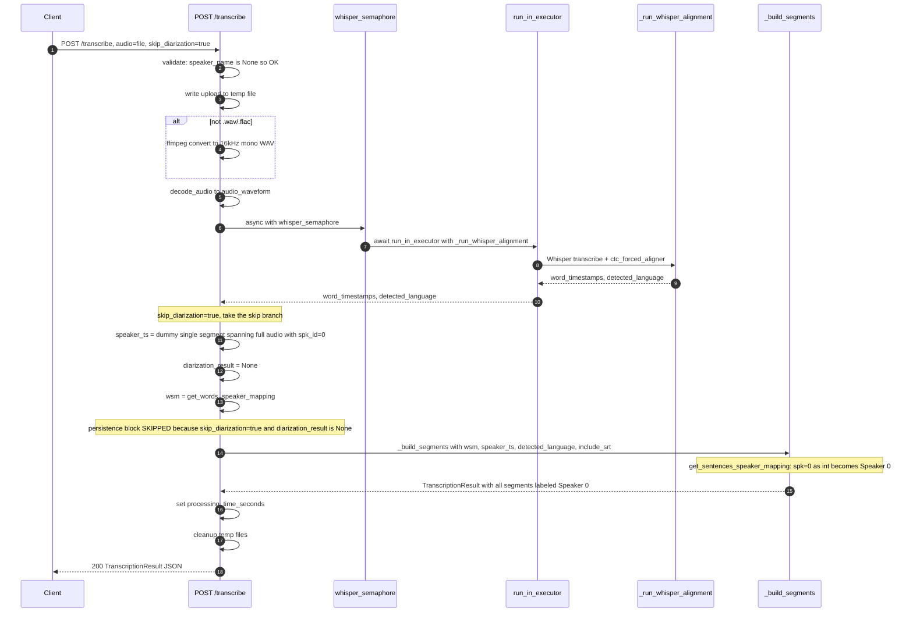

#### 5.7.2 Mode 2 — Meeting Diarization

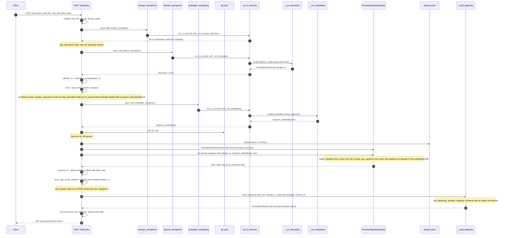

#### 5.7.3 Mode 3 — Known Speaker (Fast Response + Background DB Update)

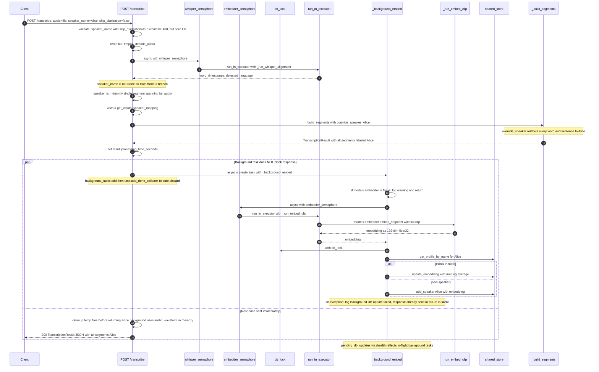

**Key Mode 3 properties:**
- The diarizer does **not** run for the response at all (confirmed by tests:
  `mock_diarize.call_count == 0`).
- Response is sent immediately after Whisper+alignment — same latency profile as Mode 1.
- The background task extracts a **single-clip embedding** (not per-segment) via
  `SpeakerEmbedder.embed_segment` over the full spoken audio, then upserts the
  speaker's profile in the DB.
- Background failure is logged but does not affect the already-sent response.
- `/health`'s `pending_db_updates` field reflects the count of in-flight background tasks.

### 5.8 Concurrency Model

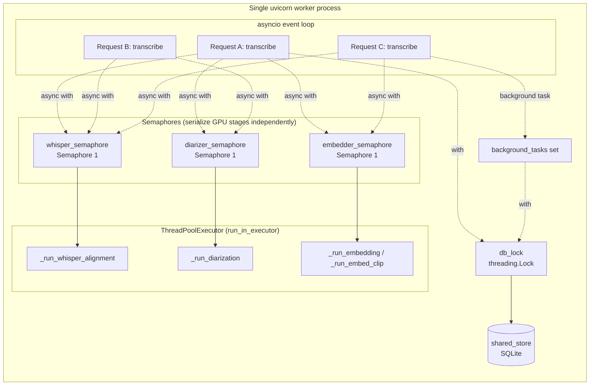

**Design principles:**
- **`async def transcribe`** — the event loop services other requests during `await`s.
- **`run_in_executor`** for GPU calls — offloads blocking inference to the default `ThreadPoolExecutor` so the event loop is not blocked.
- **Three independent `asyncio.Semaphore(1)`** — each GPU model stage is serialized within itself (only one Whisper inference, one diarization, one embedding extraction at a time), but the three stages can overlap across requests because they use different GPU models.
- **`db_lock` (threading.Lock)** — a process-wide mutex wrapping all `shared_store` access. Combined with the store's internal lock + `BEGIN IMMEDIATE` transactions, this prevents TOCTOU races on the SQLite DB.
- **Single uvicorn worker** — the in-memory `models`, semaphores, `db_lock`, and `background_tasks` set are all process-local. Multiple workers would each load their own GPU models and DB connection, breaking the serialization invariants.
- **Background task lifecycle** — Mode 3 creates an `asyncio.Task`, adds it to `background_tasks`, and attaches `background_tasks.discard` as a done-callback so the set auto-prunes. On shutdown every task is cancelled and awaited up to 10 s, then the store is closed.

### 5.9 Response Shape — `POST /transcribe`

```json
{
  "segments": [
    {
      "speaker": "Alice",
      "start_time": 0.0,
      "end_time": 1500.0,
      "text": "hello world"
    }
  ],
  "srt": "1\n00:00:00,000 --> 00:00:01,500\nAlice: hello world\n\n...",
  "language": "en",
  "processing_time_seconds": 2.34
}
```

- `segments` is **sentence-level** (built from `get_sentences_speaker_mapping`); there is no `words` field in the response.
- `start_time`/`end_time` are in **milliseconds** (ints internally, exposed as `float`).
- `srt` is present iff `include_srt=True` (default); built via `helpers.write_srt`.
- `speaker` values: Mode 1 → `"Speaker 0"`; Mode 2 → stored name (`"Alice"`) or auto-assigned `"Speaker N"` for unrecognized clusters; Mode 3 → the supplied `speaker_name` for every segment.

### 5.10 Helper Functions

| Function | Line | Purpose |
|---|---|---|
| `_run_whisper_alignment(audio_waveform, language, batch_size, suppress_numerals)` | 256-303 | Whisper transcription + ctc_forced_aligner; returns `(word_timestamps, detected_language)` |
| `_run_diarization(audio_waveform, num_speakers=None)` | 306-309 | Wraps `models.diarizer_model.diarize(...)` |
| `_run_embedding(audio_waveform, speaker_ts)` | 312-315 | Wraps `models.embedder.embed_segments(...)` (Mode 2, per-segment) |
| `_run_embed_clip(audio_waveform, start_ms, end_ms)` | 318-321 | Wraps `models.embedder.embed_segment(...)` (Mode 3 background, single clip) |
| `_build_segments(wsm, speaker_ts, detected_language, include_srt, override_speaker=None)` | 324-379 | Punctuation → realign → `get_sentences_speaker_mapping` → build `TranscriptionResult`; `override_speaker` relabels every word AND sentence (Mode 3) |
| `_background_embed` (nested closure) | 476-494 | Mode 3 only — embedder + DB upsert under `embedder_semaphore` + `db_lock` |

### 5.11 Audio Handling

- Upload written to `tempfile.NamedTemporaryFile(suffix=upload_ext, delete=False)`.
- **Pass-through formats**: `.wav` and `.flac` skip ffmpeg.
- **Converted formats** (mp3, ogg, m4a, webm, etc.): `ffmpeg -y -i <in> -ar 16000 -ac 1 -c:a pcm_s16le <out>`.
- `FileNotFoundError` (ffmpeg missing) → HTTP 500; `CalledProcessError` → HTTP 400 with first 500 bytes of stderr.
- Temp files cleaned up after the response is built (Mode 3 cleans up **before** returning because the background task references the in-memory `audio_waveform`, not the files).

---

## 6. Known Issues & Caveats

1. **`diarize.py:315` and `diarize_parallel.py:325` are missing the `detected_language` argument** that `get_sentences_speaker_mapping` now requires (signature is `get_sentences_speaker_mapping(word_speaker_mapping, spk_ts, detected_language)`). Only `server.py:350` passes it correctly. **Running the two CLI scripts end-to-end will `TypeError` at that line.** Fix: `get_sentences_speaker_mapping(wsm, speaker_ts, info.language)`.

2. **`match_speakers` is per-segment, not per-speaker** — the BRANCH_CONTEXT.md description of a `{speaker_id: embedding}` dict input with "higher-score-wins" collision resolution reflects an **earlier** design (pre-commit `360ed24`). The current matcher does independent per-segment matching; collision-like behavior is handled downstream via cluster-label voting and `merge_new_speakers`.

3. **Persistence is MSDD-only** via the `isinstance(diarization_result, DiarizationResult)` gate in `diarize.py:263`. `SortformerDiarizer.diarize()` returns a plain list, so persistence is silently disabled for sortformer. (The branch spec explicitly chose MSDD-only because Sortformer is end-to-end without exposed embeddings.)

4. **`resolve_speakers` returns a segment-index-keyed map** (`dict[int, str]`), not a speaker-id-keyed map. `apply_persistent_labels` looks up by segment index `i`, not by `spk_id`.

5. **`SpeakerEmbeddingStore.show_speaker` does not exist** — "show" is a `speakerctl.py` command and a server endpoint, both built on `list_speakers()`.

6. **`find_best_match` default threshold is 0.6**, but the pipeline uses `match_speakers` (default 0.75). `find_best_match` is the scalar variant, not on the main batch path.

7. **`--match-threshold` default is 0.75** in the code, not 0.6 as stated in BRANCH_CONTEXT.md. The default was raised during per-segment-embedding work.

8. **Running average drift**: stored embeddings drift from unit norm over time as more samples are averaged in. `find_best_match`/`match_speakers` re-normalize before comparison, so matching remains correct.

9. **`--interactive` mode in `diarize_parallel.py`** works but prompts appear after both Whisper and NeMo have finished (due to parallel execution). Interactive mode is **not available in the server** (no stdin in HTTP context); new speakers are always auto-labeled.

10. **Mode 3 background embedding failure** is logged but does not affect the already-sent response; the DB update is simply lost.

11. **The server does not produce JSON or VTT output** — the original CLI writes only `.txt` and `.srt`; the server builds a JSON response inline but has no VTT support.

12. **End-to-end testing requires a GPU with NeMo installed**; unit tests run without those dependencies thanks to the `conftest.py` mocks.

---

## 7. Quick Reference

### 7.1 Original Pipeline — One-Line Summary

```
audio → Demucs(vocals) → faster-whisper(transcript) → ctc-forced-aligner(word_ts)
      → NeMo MSDD(speaker_ts) → get_words_speaker_mapping → DeepMultilingualPunctuation
      → get_sentences_speaker_mapping → .txt + .srt
```

### 7.2 Branch Pipeline — One-Line Summary (Stage 4.5 added)

```
... → NeMo MSDD(speaker_ts) → [Stage 4.5: SpeakerEmbedder.embed_segments
      → match_speakers → PersistentSpeakerDiarizer.resolve_speakers
      → apply_persistent_labels → rebuild wsm] → DeepMultilingualPunctuation → ...
```

### 7.3 Server Mode Selection Cheat Sheet

| Want... | Send |
|---|---|
| Fast transcription, no speaker labels | `skip_diarization=true` |
| Full meeting transcript with persistent speaker names | (defaults: `skip_diarization=false`, `speaker_name=null`) |
| Fast transcription for a known speaker + update their embedding | `speaker_name="Alice"` (must NOT set `skip_diarization=true`) |
| Disable DB matching for one request (Mode 2 only) | `no_persist=true` |
| Tune match strictness | `match_threshold=0.8` (higher = stricter) |
| Smaller response payload | `include_srt=false` |

### 7.4 File-to-Responsibility Map

| File | Responsibility |
|---|---|
| `diarize.py` | Sequential CLI pipeline (original + branch hooks) |
| `diarize_parallel.py` | Parallel CLI pipeline (Whisper ∥ NeMo, MSDD-only) |
| `helpers.py` | Word/sentence mapping, SRT/TXT writers, lang tables, `process_language_arg` |
| `diarization/msdd/msdd.py` | MSDDDiarizer (NeMo wrapper) + `DiarizationResult` dataclass |
| `diarization/sortformer/sortformer.py` | SortformerDiarizer (NeMo wrapper, ≤4 spk) |
| `server.py` | FastAPI service: preloaded models, 3 API modes, speaker REST endpoints |
| `speaker_store.py` | `SpeakerEmbeddingStore` — SQLite-backed speaker profiles |
| `speaker_embedder.py` | `SpeakerEmbedder` — titanet_large wrapper, 192-dim embeddings |
| `speaker_matcher.py` | `match_speakers()` — vectorized cosine similarity |
| `persistent_diarizer.py` | `PersistentSpeakerDiarizer` orchestrator + `apply_persistent_labels` |
| `speakerctl.py` | CLI for speaker profile management (list/rename/delete/show/deleteall) |
| `tests/conftest.py` | Mocks NeMo/torch/etc. so tests run without GPU |
